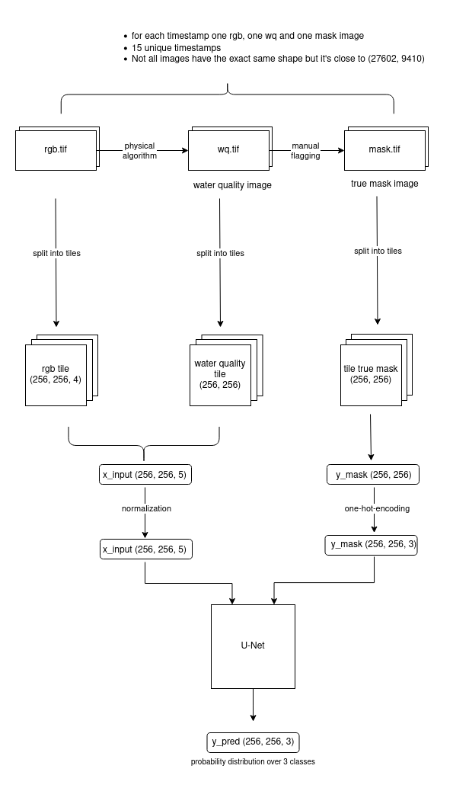

# Geospatial ML

## Project Intro

Satellite images can be used to calculate water quality and depth. Most steps in this process are fully automated, but
it is still essential that in the last step, a geographer reviews the calculated results and flags out certain parts of
the image, if necessary. Causes for this are cloud shadows, which make pixels darker than they actually are, sun glint,
and some others. Our project aims to automate the final reviewing process by training a convolutional neural network (
e.g. U-Net) to predict the correct label for each pixel (Semantic Image Segmentation).

todo: add graphic

## Installation

To get started with this project, follow the steps below:
We are using poetry as a dependency manager.

Requirements: Python 3.10 ≤

Install [poetry](https://python-poetry.org/)

1. Clone the repository using `git clone <repository_url>`.

2. Activate poetry virtual environment.

```
# Create a virtual environment
$ poetry shell
# Install all packages
$ poetry install
```

## Dataset

Our dataset contains large satellite images taken from the reservoir Lake Cahora Bassa in Mozambique at 15 different
times. The satellite images are RGB images with an additional alpha channel. In addition to the satellite images, the
dataset includes a water-quality image (wq image) with one channel and a mask image with one channel for each timestamp.

The water quality image and the mask image contain one channel valued between 0 and 255.

- All pixels with 253 and 255 are labeled as invalid.
- All pixels with value 0 are labeled as land.
- The rest of the pixels are labeled as valid.

### Small excerpt from the dataset:


As the example images show that the wq image is already partly flagged. The white parts represent the clouds while the
gray parts represent cloud shadows. However the flagging is not the same as in the mask image. A geologist manually
adapts the flagging with his expertise. The challenge of this project is to train a neural network so that the result is
closer to the mask image than the wq image.

To train our machine learning model we combined the rgb images and the water quality images into one input image
with 5 channels. As the size of each image is too large to use it as input for the neural network we split each image
into smaller tiles of size 256 x 256 once with an overlap of 56 pixels and once without overlapping.

### Overview of the data preparation steps:



### Data exploration

Our dataset is imbalanced, meaning the number of pixels per label differ:

- Mean percentage of invalid tiles: 23.48 %
- Mean percentage of valid tiles: 31.89 %
- Mean percentage of land tiles: 44.63 %

For more details check out
the [data exploration notebook](https://github.com/emely3h/Geospatial_ML/blob/main/data_exploration/data_exploration.ipynb)

### Data cleaning

As we did not have any inconsistencies or missing values in our dataset we only had to

- remove irrelevant data (tiles that only contained land pixels were removed)
- create mask (pixel values needed to be translated into labels)
- normalize data (rgb channels needed to be normalized as unet works best with input values between 0 and 1)
- one-hot-encoding

## Folder Structure

### [prepare_data/](https://github.com/emely3h/Geospatial_ML/tree/main/prepare_data)

To split the images into tiles, follow these steps:

1. Create an empty `/data` folder in the project root directory.
2. Copy the two subfolders `unflagged` and `flags_applied` from the original data folder into the project `/data`
   folder.
3. Create a `.env` file in the root directory and define the `DATA_PATH` variable
4. Run `main.py` in the `/prepare_data` directory to prepare the data for analysis.

The result is a folder named /google_drive that contains one compressed file per date. Each file consists of the
true_mask array and the x_input array which are used to train the neural network.

5. Execute the `/full_dataset_splitting_mmaps.ipynb` notebook

### [models/](https://github.com/emely3h/Geospatial_ML/tree/main/models)

In this folder, all models used for training are saved and some additional helper function. To train our network used
the u-net architecture.

### [experiments/](https://github.com/emely3h/Geospatial_ML/tree/main/experiments)

All experiments that have been done are saved here.

### [data_exploration/](https://github.com/emely3h/Geospatial_ML/tree/main/experiments)

In this folder we explored our dataset to know about the class imbalance, number of tiles per image and the overlap
between the input image and the true
mask ([physics_jaccard](https://github.com/emely3h/Geospatial_ML/blob/main/data_exploration/physics_jaccard.ipynb)).

### [evaluation/](https://github.com/emely3h/Geospatial_ML/tree/main/evaluation)

This folder contains all helper methods and functions to calculate metrics for each trained folder which are saved on
google drive.

## Evaluation Metrics

The model performance is evaluated with
the [Intersection over Union](https://www.tensorflow.org/api_docs/python/tf/keras/metrics/IoU) (Jaccard Index) because
the dataset is imbalanced which means that accuracy might be biased towards the larger class, whereas the
Jaccard Index
provides a more accurate measurement of similarity between
predicted and actual labels. The Intersection over Union is calculated for each label separately. To evaluate the
model performance the mean for all 3 labels is calculated. In addition to the Jaccard
Index the F1 Score, Precision, Recall and
specificity are also calculated and used to evaluate the model performance. to get an insight into the true positive
rate, the ratio between true positives and false negatives and the
true negative rate.

## Summary of the experiments

I started with a u-net architecture very similar to
the [original architecture](https://lmb.informatik.uni-freiburg.de/people/ronneber/u-net/) except that I used one
convolutional layer less to make the training faster in the beginning.
Experiment 1 explores the variance when training multiple models with the same configuration. To simplify the setup
and get familiar with the libraries only a small subset of the entire dataset with overlapping tiles was used.
Experiment 2 is similar to experiment 1 except for the dataset, as non-overlapping tiles were used instead.

In experiment 3 the entire dataset was used for the training. As the RAM capacity was not sufficient DataGenerators
were used so that the data was loaded in batches into RAM. Three models were trained with slightly different
training configurations. The training of model 0 was stopped to early which led to underfitting while the training
of model 1 was too long which led to overfitting. Model 2 was trained with an adjusted early stopping rate (10
instead of 5 as in model 1), adjusted callback that monitors validation accuracy and loss and a checkpoint callback
which saves the model after the best performing epoch. The best performing model can make predictions with a mean
intersection over union of 0.935624.
The aim of notebook 4 and 5 was to explore variance in the training. Therefore, 5 models each for overlapping and
non-overlapping tiles were trained with the optimized configuration of experiment 3. As the variance was
lower and the mean intersection over union was slightly better for the non-overlapping dataset all further
experiments continue with the non-overlapping dataset.

The goal of the following experiments is to get familiar with hyperparameters, to find the optimal combination of
hyperparameters. I split the hyperparameters into three different categories:

Training Configuration

- Number of Epochs (experiment_3)
- Callbacks (experiment_3)
- Optimizer (experiment 7)
- Learning rate (experiment 7)
- Batch size

Model Parameters

- amount of conv2d layers (experiment 8)
- activation functions

Overfitting avoidance

- dropout (experiment 9)

My approach was to find a good training configuration first and then move on to optimize the unet architecture
before experimenting with regularization methods.
In experiment 6 the early stopping callback was optimized to check the mean intersection over union and the loss
instead of the accuracy.
In experiment 7 different optimizers with different learning rates were tested. Given the resources AdamW performed
best. The best model could perform with a jaccard index of 0.951696. At this point a good training configuration was
found and I moved on to optimizing the unet architecture.
In experiment 8 I tested different amounts of Conv2D layers with different amounts of filter sizes. Only the
architecture with one convolutional layer less than the original performed better than the one I started with. The
intersection over union could be improved to 0.95598.

## Final result

The first unet trained on the entire dataset performed with an intersection over union of `0.900786`. After
hyperparameter
optimization the metric could be improved to `0.951696`
As a benchmark, the overlap between the wq image and the final mask image was calculated. The mean intersection over
union for the test data is `0.897474`.

## Working with google colab

_Only edit and push jupyter notebooks on google colab, edit and push .py scripts always locally!_

As it is only possible to push changes on jupyter notebooks to github from google colab it is best to do all changes in
the scripts locally.
Run all the prepare data scripts locally and only store the final numpy array in google drive.

- The MachineLearning folder will appear in your google drive `shared with me` subfolder. To access it from within colab
  you need to create a shortcut. (left click on the folder, 'add shortcut')
